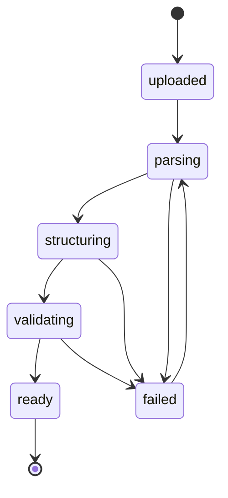
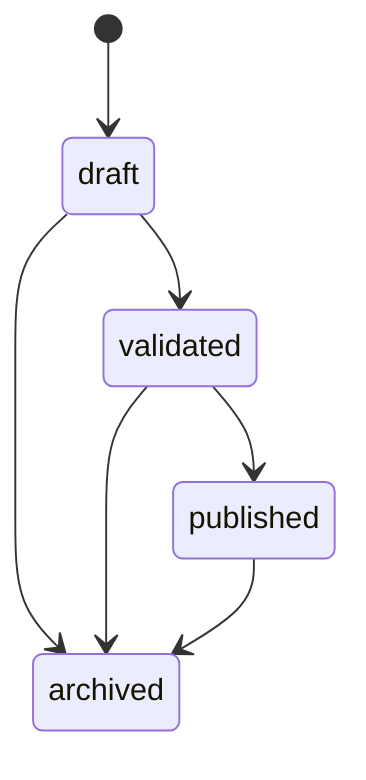
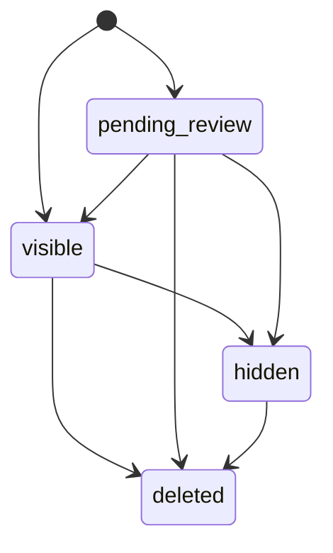

# Backend State Machine

## 目标

这份文档用状态机方式明确三类核心对象的生命周期：

1. 导入任务
2. 发布版本
3. 评论审核状态

这样后端、前端、运营在实现时不会各自理解一套状态。

## 设计原则

1. 任务状态和版本状态分开，不混用。
2. 评论状态和审核动作分开，不混用。
3. 每个状态都要能回答“还能不能继续往下走”。

## 一、导入任务状态机

### 任务对象

- `guide_import_jobs`

### 推荐状态

- `uploaded`
- `parsing`
- `structuring`
- `validating`
- `ready`
- `failed`

说明：

- `published` 不属于导入任务状态
- 发布是版本行为，不是导入任务行为

### 状态图

### 状态含义

| 状态 | 含义 | 前端可见动作 |
| --- | --- | --- |
| `uploaded` | 文件已收下，尚未开始处理 | 展示“已上传” |
| `parsing` | 正在提取段落、图片和引用顺序 | 展示“解析中” |
| `structuring` | 正在调豆包做结构化 | 展示“结构化处理中” |
| `validating` | 正在做 schema 和完整性校验 | 展示“校验中” |
| `ready` | 结果可供审核 / 发布 | 展示“可发布” |
| `failed` | 本次处理失败 | 展示失败原因和重试 |

## 二、发布版本状态机

### 对象

- `guide_render_versions`

### 推荐状态

- `draft`
- `validated`
- `published`
- `archived`

### 状态图

### 状态含义

| 状态 | 含义 |
| --- | --- |
| `draft` | 已生成，但还未确认可上线 |
| `validated` | 已通过校验，可供发布 |
| `published` | 当前线上版本 |
| `archived` | 历史版本，不再作为当前线上版本 |

### 规则

1. 同一个 `guide_slug` 同一时刻只能有一个 `published`
2. 发布新版本时，旧线上版本进入历史状态
3. 回滚本质上是把历史版本重新发布，而不是改写旧记录

## 三、评论状态机

### 对象

- `story_point_comments`

### 推荐状态

- `visible`
- `pending_review`
- `hidden`
- `deleted`

### 状态图

### 规则

1. 文本评论默认尽量进入 `visible`
2. 带图评论默认进入 `pending_review`
3. `hidden` 用于审核隐藏，不等于物理删除
4. `deleted` 代表逻辑删除

## 四、推荐的事件流

### 导入事件

- `job_uploaded`
- `job_parse_started`
- `job_parse_failed`
- `job_structuring_started`
- `job_validation_passed`
- `job_failed`
- `job_ready`

### 发布事件

- `version_created`
- `version_validated`
- `version_published`
- `version_archived`
- `version_rolled_back`

### 评论事件

- `comment_created`
- `comment_held_for_review`
- `comment_approved`
- `comment_hidden`
- `comment_deleted`

## 五、和数据库文档的对齐要求

如果状态机发生变化，必须同步：

- [backend-database-design.md](./backend-database-design.md)
- [backend-api-design.md](./backend-api-design.md)
- [community-moderation-design.md](./community-moderation-design.md)

## 六、当前建议

后端实现时，优先按这份状态机文档收口状态命名。

这样可以避免：

- API 返回一种状态
- 数据库存另一种状态
- 前端文案再拼第三种状态
